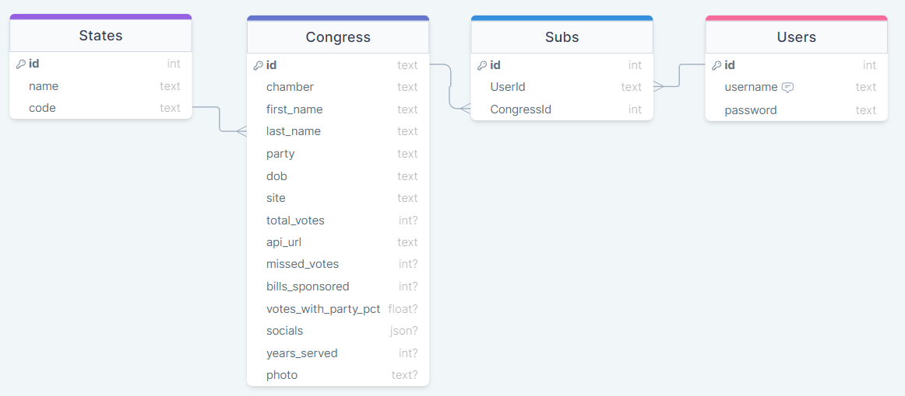

# Capstone2.5_Backend
Political Informant Application - Express Backend w/ PostgreSQL DB

## ToDo:
 - Nothing at this point. Front-end Work!

## Technical Overview
Express.js REST API handling a PostgreSQL DB

### Tech Stack
- Express.js REST API
- Sequelize - ORM to manage psql DB
- Deployed on Fly.io [pi-backend-api.fly.dev](https://pi-backend-api.fly.dev/)

### General Flow
- The backend will hold all congressional member data and user information for the application via DB.
  - Congressional Member data fetched from APIs:
    - [ProPublica Congress API](https://projects.propublica.org/api-docs/congress-api/)
      - Limited to 5000 Requests per day
    - [Congress.gov API](https://api.congress.gov/#/)
      - Used to get Member Photo URL
    - Congressional Member data will be sanatized before being stored. Will only be served via GET requests.
  - User login/loggout/create via POST requests

### Database Schema

- Addtional Data to be delivered upon request:
  - socials
    - twitter
    - facebook
    - youtube
  - bills_sponsored
  - bills_cosponsored
  - total_votes
  - missed_votes
  - votes_with_party_pct
  - years_served
  - photo

This info will be added to the response json back to Client. Client will be saving the complete member object locally in the component/redux (TBD)
